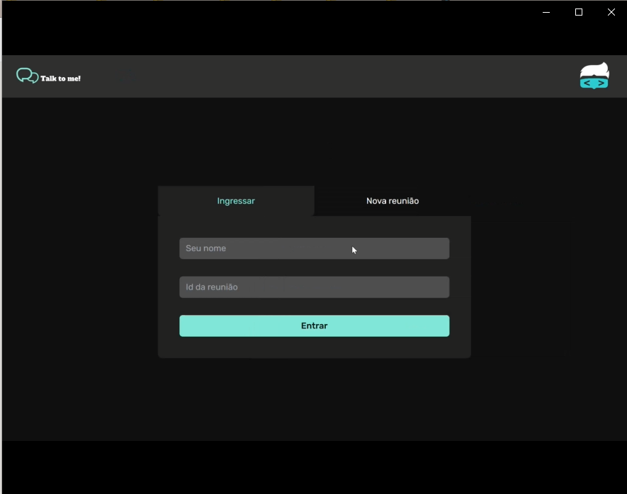
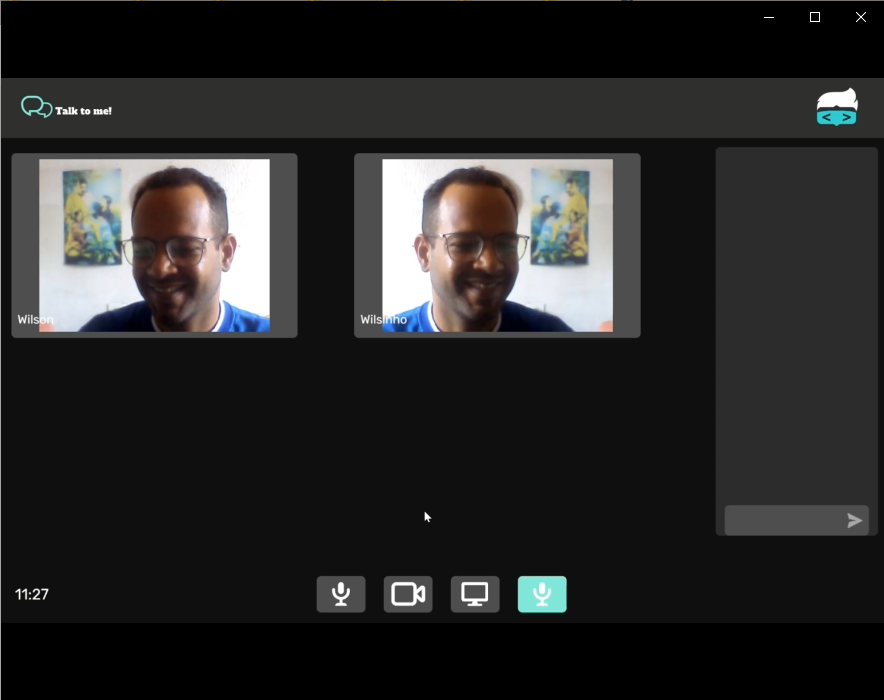

<!-- _class: invert -->

## Semana do Heroi

##### Evento realizado pela hero code

##### Projeto Talk to me

Tecnologias utilizadas nesse projeto
-Next.js
-Tailwind Css
-Socket.io
-WebRTC
-Node.js

Para executar o projeto
Clone o projeto do git, com o git clone

acesse a pasta backend,
rode o comando npm install - instala todas as dependencias do back
rode o comando npm run dev - rodar a aplicação

acesse a pasta frontend,
rode o comando npm install - instala todas as dependencias do front
rode o comando npm run dev - rodar a aplicação
Acesse pelo navegador o endereço http://localhost:3000

